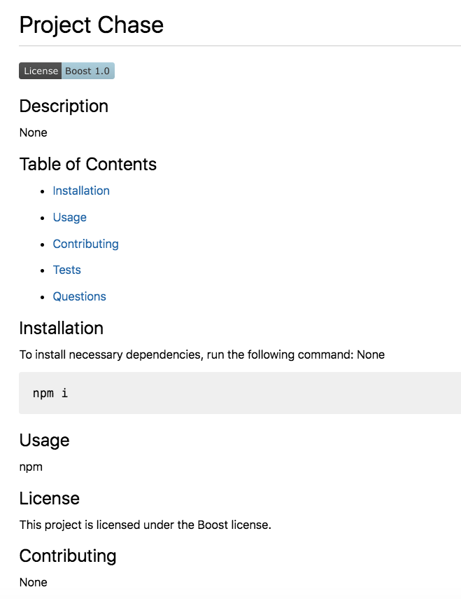

# Professional README Generator

Goal: Create ReadMe file generator using node/javascript concepts.

Layout should be close to the following: 

Page is deployed using GitHub at https://sarahbinaz1020.github.io/read-me-generator/index.html

You can also walk-through a step-by-step video demonstrating the functionality: https://youtu.be/HgqopDa2NcQ